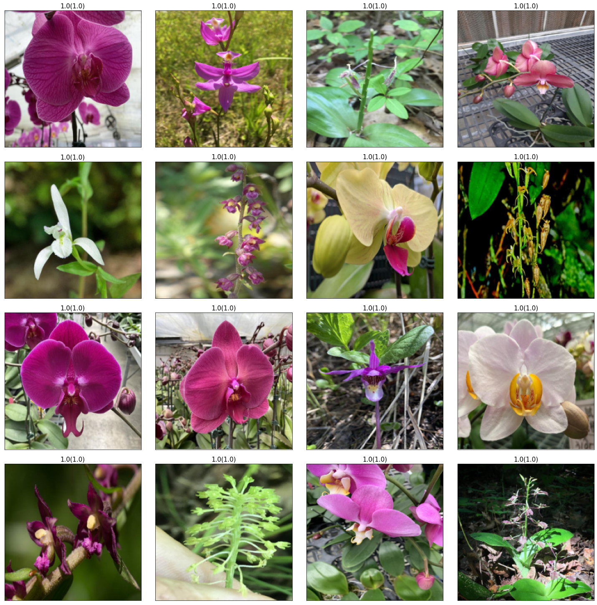

# T-Brain: Orchids

[尋找花中君子 - 蘭花種類辨識及分類競賽](https://tbrain.trendmicro.com.tw/Competitions/Details/20)

這個競賽與 [@Tsao666](https://github.com/Tsao666) 及 [@Tianming8585](https://github.com/Tianming8585) 共同參賽，我們的最終排名為 37/275 (13%)

## 簡介

臺灣蘭花栽培歷史悠久、品種繁多，產量及品質在國際上受到肯定，臺灣有著領先全球的蘭花育種研發，擁有世界上最多的蝴蝶蘭品種，九成的蝴蝶蘭用於出口，使其成為國內精緻農業金額首位

但因農業生物科技的進步，大量組織苗的繁殖，影響新品種的研發，加上其它國家積極投入育種生產，育種廠商大都有其專注培養的品種，由於各蘭花品種的型態較為類似，往往需要專業人士才能進行區別，目前全球均未有蝴蝶蘭品種的辨識軟體與技術，本競賽欲透過舉辦蘭花種類辨識及分類競賽，邀集具AI、機器學習、深度學習專長的專家與高手，訓練出高辨識率的蘭花品項影像辨識模型，除了能提升產業競爭力外，更讓社會大眾對於蘭花這類高經濟作物有更多的認識，進一步提升蝴蝶蘭的銷售與產值

評分標準：Accuracy x 0.5 + Macro F1-score x 0.5；最終得分 = Public 成績 x 0.3 + Private 成績 x 0.7

議題提供單位：國立中正大學資訊工程學系

## 活動時間

議題進行時間以台灣時間（UTC+8 小時）為主，其時程如下:

- 2022/04/01 開放下載訓練資料集
- 2022/06/06 開放下載 Public 及 Private 測試集並公布 Public Leaderboard 成績
- 2022/06/07 關閉上傳答案，並公布 Private Leaderboard 成績
- 2022/08/01 公布最終結果

比賽期間共可以上傳 5 次答案

## 排名

參加期間總共上傳 5 次答案，最終排名如下

|         |    成績     |     排名     |
| :------ | :---------: | :----------: |
| Public  |  0.873971   | 35/275 (12%) |
| Private | 0.737483444 | 37/275 (13%) |
