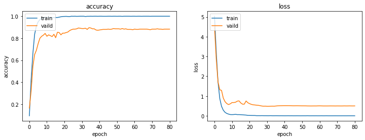

# Experiment

紀錄並分析實驗的結果，績效評量指標為 Accuracy x 0.5 + Macro F1-score x 0.5

由於使用複數 TPU 進行訓練，模型的確定性無法被完全控制

## Baseline

|      | level | image | epochs | batch |  lr  | dropout | final score |
| :--: | :---: | :---: | :----: | :---: | :--: | :-----: | :---------: |
| [^1] |  B3   |  300  |  300   |  256  | 5e-5 |   0.3   |  0.726489   |

[^1]: efficientnetb3-transfer-trainable-epochs300-batchsize256-lr5e-05-dropout30-1024-300

使用以 imagenet 為資料集的 EfficientNet 預訓練權重為初始權重，再將模型輸出轉為 219 類

參考 Keras 官方的[範例模型架構](https://keras.io/examples/vision/image_classification_efficientnet_fine_tuning/)進行設計，並且在讀取 `imagenet` 的預訓練權重後，訓練過程中允許對這些權重進行調整

```python
def get_model(input_shape, num_classes, learning_rate, dropout):
    model = tf.keras.models.Sequential()
    model.add(tf.keras.applications.EfficientNetB3(input_shape=input_shape, include_top=False, weights='imagenet', drop_connect_rate=dropout))
    model.add(tf.keras.layers.GlobalAveragePooling2D(name="avg_pool"))
    model.add(tf.keras.layers.BatchNormalization())
    model.add(tf.keras.layers.Dropout(dropout, name="top_dropout"))
    model.add(tf.keras.layers.Dense(units=1024, activation='relu', kernel_initializer=tf.keras.initializers.he_uniform(seed=5397)))
    model.add(tf.keras.layers.Dense(units=num_classes, activation='softmax', kernel_initializer=tf.keras.initializers.he_uniform(seed=5397), name="pred"))
    optimizer = tf.keras.optimizers.Adam(learning_rate=learning_rate, beta_1=0.9, beta_2=0.999, epsilon=1e-08)
    model.compile(optimizer=optimizer, loss='categorical_crossentropy', metrics=['categorical_accuracy'])
    return model
```

## Data Augmentation

|      | level | augment | image | epochs | batch |  lr  | dropout | final score |
| :--: | :---: | :------ | :---: | :----: | :---: | :--: | :-----: | :---------: |
| [^1] |  B3   |         |  300  |  300   |  256  | 5e-5 |   0.3   |  0.726489   |
| [^2] |  B3   | 0.15    |  300  |  300   |  256  | 5e-5 |   0.3   |  0.786486   |

[^2]: efficientnetb3-transfer-trainable-datagen15-epochs300-batchsize256-lr5e-05-dropout30-1024-300

由於題目是小資料（訓練）對大資料（測試），每種植物的訓練樣本只有 10 張，所以使用 tensorflow.keras 的 Augmentation Layer 進行影像資料增強，結果可以發現績效明顯提升 6%

```python
def get_augmentation(factor=0.15):
    augmentation = tf.keras.models.Sequential()
    augmentation.add(tf.keras.layers.RandomContrast(factor=factor))
    augmentation.add(tf.keras.layers.RandomFlip('horizontal_and_vertical'))
    augmentation.add(tf.keras.layers.RandomZoom(factor, factor))
    augmentation.add(tf.keras.layers.RandomTranslation(height_factor=factor, width_factor=factor))
    augmentation.add(tf.keras.layers.RandomRotation(factor=factor))
    return augmentation
```


## EfficientNet: B3~B7

|      | level | augment | image | epochs | batch |  lr  | dropout | final score |
| :--: | :---: | :------ | :---: | :----: | :---: | :--: | :-----: | :---------: |
| [^3] |  B3   | 0.15    |  300  |  300   |  128  | 5e-5 |   0.3   |  0.804425   |
| [^4] |  B5   | 0.15    |  456  |  300   |  128  | 5e-5 |   0.3   |  0.835578   |
| [^5] |  B7   | 0.15    |  456  |  500   |  128  | 5e-5 |   0.3   |  0.835801   |

[^3]: efficientnetb3-transfer-trainable-datagen15-epochs300-batchsize128-lr5e-05-dropout30-1024-300
[^4]: efficientnetb5-transfer-trainable-datagen15-epochs300-batchsize128-lr5e-05-dropout30-1024-456
[^5]: efficientnetb7-transfer-trainable-datagen15-epochs500-batchsize128-lr5e-05-dropout30-1024-456

嘗試增加 EfficientNet 的模型深度，發現 B7 的效果最好

根據 EfficientNet 原始論文，使用較深模型的時候影像尺寸也應該要更大，所以在 B5 及 B7 將影像尺寸調整為 456x456

## Structure Simplification

|      | level | augment | image | epochs | batch |  lr  | dropout | final score |
| :--: | :---: | :------ | :---: | :----: | :---: | :--: | :-----: | :---------: |
| [^5] |  B7   | 0.15    |  456  |  500   |  128  | 5e-5 |   0.3   |  0.835801   |
| [^6] |  B7   | 0.15    |  456  |  500   |  128  | 5e-4 |   0.2   |  0.847586   |

[^6]: efficientnetb7-transfer-trainable-datagen15-simple-epochs500-batchsize128-lr5e-04-dropout20-456

根據過往經驗，未驗證的自建模型效果通常比較差，而作為 Baseline 的 Keras 參考模型之所以在 EfficientNet 層後面追加 BatchNormalization 層與 Dense 層是因為該範例不允許 EfficientNet 層的權重被訓練，所以需要這些層來增加模型的表現，但是在這邊我們既然允許 EfficientNet 層的權重被訓練，就沒必要再加入額外的層，故將模型架構簡化，結果績效提升 1%

```python
def get_model(input_shape, num_classes, learning_rate, dropout):
    model = tf.keras.models.Sequential()
    model.add(tf.keras.applications.EfficientNetB7(input_shape=input_shape, include_top=False, weights='imagenet', drop_connect_rate=dropout))
    model.add(tf.keras.layers.GlobalAveragePooling2D(name="avg_pool"))
    model.add(tf.keras.layers.Dense(units=num_classes, activation='softmax', kernel_initializer=tf.keras.initializers.he_uniform(seed=5397), name="pred"))
    optimizer = tf.keras.optimizers.Adam(learning_rate=learning_rate, beta_1=0.9, beta_2=0.999, epsilon=1e-08)
    model.compile(optimizer=optimizer, loss='categorical_crossentropy', metrics=['categorical_accuracy'])
    return model
```

## LR Reduce

|      | level | augment | image | epochs | batch |  lr  | reducelr | dropout | final score |
| :--: | :---: | :------ | :---: | :----: | :---: | :--: | :------: | :-----: | :---------: |
| [^6] |  B7   | 0.15    |  456  |  500   |  128  | 5e-4 |  false   |   0.2   |  0.847586   |
| [^7] |  B7   | 0.15    |  456  |  500   |  128  | 5e-4 |   true   |   0.2   |  0.892781   |

[^7]: efficientnetb7(transfer,trainable,datagen15,simple)-epochs500-batchsize128-lr5e-04-reducelr-dropout20-456

根據過往研究，在訓練過程中逐漸降低學習率可以讓模型更容易收斂，所以在這邊加入了 ReduceLROnPlateau 這個 Callback，結果績效提升 5%


